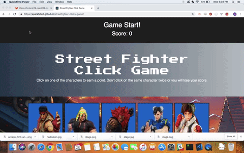
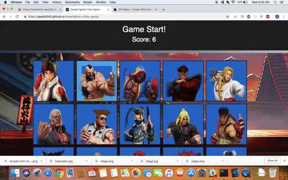

# Street Fighter Clicky Game

https://apark5040.github.io/streetfighter-clicky-game/

## Overview

This is Street Fighter themed memory game where you must click on all 15 characters only once. You lose if you click on the same character twice. 

<<<<<<< HEAD

=======

>>>>>>> 1351d0fe822ce4ec22c09f9c9ee7895b7f740abd

## Instructions

The game starts when the page loads. When the user clicks on a character image, the images will shuffle around and the user will be granted a point. Clicking on the same character image twice will reset the score counter and the user will have to start all over. 

<<<<<<< HEAD

=======

>>>>>>> 1351d0fe822ce4ec22c09f9c9ee7895b7f740abd
